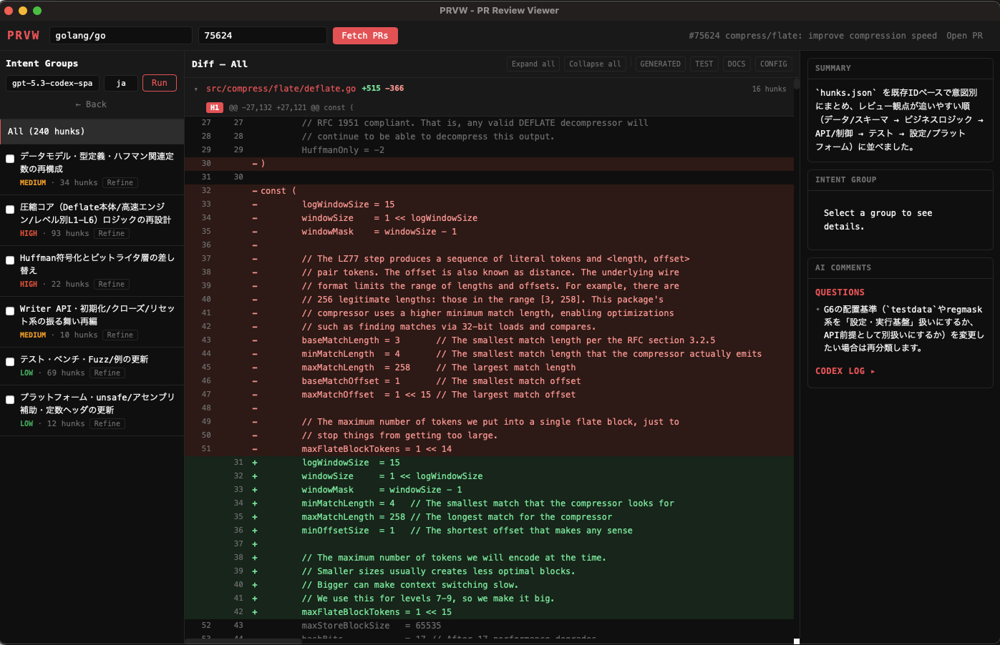

# PRVW — PR Review Viewer

A desktop diff viewer that fetches GitHub PRs, structures diffs into hunks, and uses LLM (Codex CLI) to group changes by intent — so you can review one purpose at a time.

Built with **Tauri v2 + React + TypeScript + Rust**.



## Stack

| Tool | Role | Install |
|------|------|---------|
| **Node.js** (v18+) | Frontend build | https://nodejs.org/ |
| **Rust** (stable) | Backend | `curl --proto '=https' --tlsv1.2 -sSf https://sh.rustup.rs \| sh` |
| **GitHub CLI (`gh`)** | PR list & diff | `brew install gh` |
| **Codex CLI (`codex`)** | Intent analysis (optional) | https://github.com/openai/codex |

## Setup

```bash
npm install
gh auth login
codex login   # optional — only needed for intent analysis
```

## Development

```bash
npm run tauri dev
```

## Usage

1. Enter a repo (e.g. `facebook/react`) and click **Fetch PRs**
2. Select a PR — diff is fetched, parsed, and displayed in the center pane
3. Click **Run Codex** — hunks are grouped by change intent
4. Click a group to filter the diff; summary, rationale, and checklists appear in the right pane
5. Check off groups as you review them

## Troubleshooting

| Error | Fix |
|-------|-----|
| `gh is not installed` | `brew install gh` |
| `gh is not authenticated` | Run `gh auth login` |
| `Codex CLI is not installed` | Install Codex (diff viewing works without it) |
| `Codex CLI is not authenticated` | Run `codex login` |
| Empty diff | PR has no changes — check branch comparison |
| Analysis validation error | Codex output was malformed — retry usually fixes it |

## Project Structure

```
prvw/
├── src/                    # Frontend (React + TS)
│   ├── App.tsx             # Main shell — header, routing, state
│   ├── App.css             # Styles
│   ├── types.ts            # TypeScript type definitions
│   ├── constants.ts        # Shared constants
│   ├── components/         # UI components
│   │   ├── PrList.tsx      # PR list table
│   │   ├── GroupsPane.tsx  # Left pane — intent groups
│   │   ├── DiffPane.tsx    # Center pane — diff view
│   │   └── SummaryPane.tsx # Right pane — summary / AI comments
│   ├── hooks/
│   │   └── useAnalysis.ts  # Codex analysis + refine logic
│   └── utils/
│       └── classifyFile.ts # File category classification
├── src-tauri/              # Backend (Rust)
│   ├── schemas/            # JSON schemas for Codex output
│   └── src/
│       ├── lib.rs          # Tauri app init
│       ├── types.rs        # Shared structs
│       ├── gh.rs           # GitHub CLI commands
│       ├── diff_parser.rs  # Unified diff parser
│       ├── codex.rs        # Codex CLI commands (analyze, refine)
│       └── validation.rs   # Analysis result validation
├── index.html
└── package.json
```
